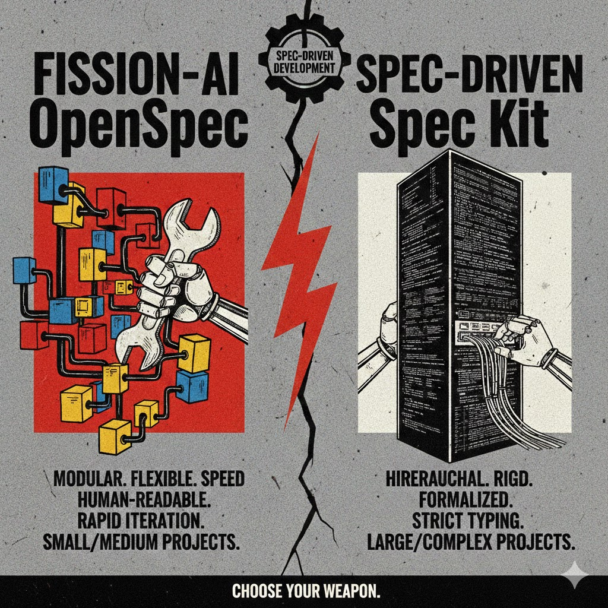

# Documents_AI

Репозиторий с документами по методологиям SDD: OpenSpec, SpecKit, Kiro. Ключевые документы:

- OpenSpec SDD Template: [SDD_OpenSpec.md](SDD_OpenSpec.md)
- Spec-Driven Development (Spec Kit): [SDD_SpecKit.md](SDD_SpecKit.md)
- Kiro SDD: [SDD_Kiro.md](SDD_Kiro.md)
- Универсальный шаблон SDD: [SDD_Template.md](SDD_Template.md)

Используйте эти файлы как основу для описания требований, дизайна и планирования задач в проектах.
