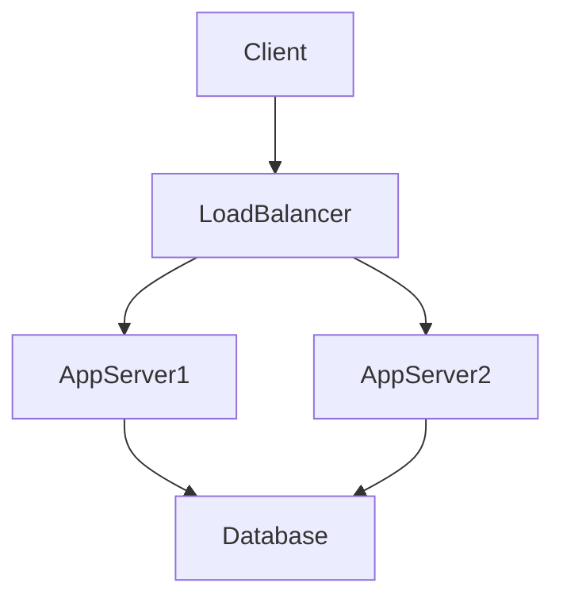
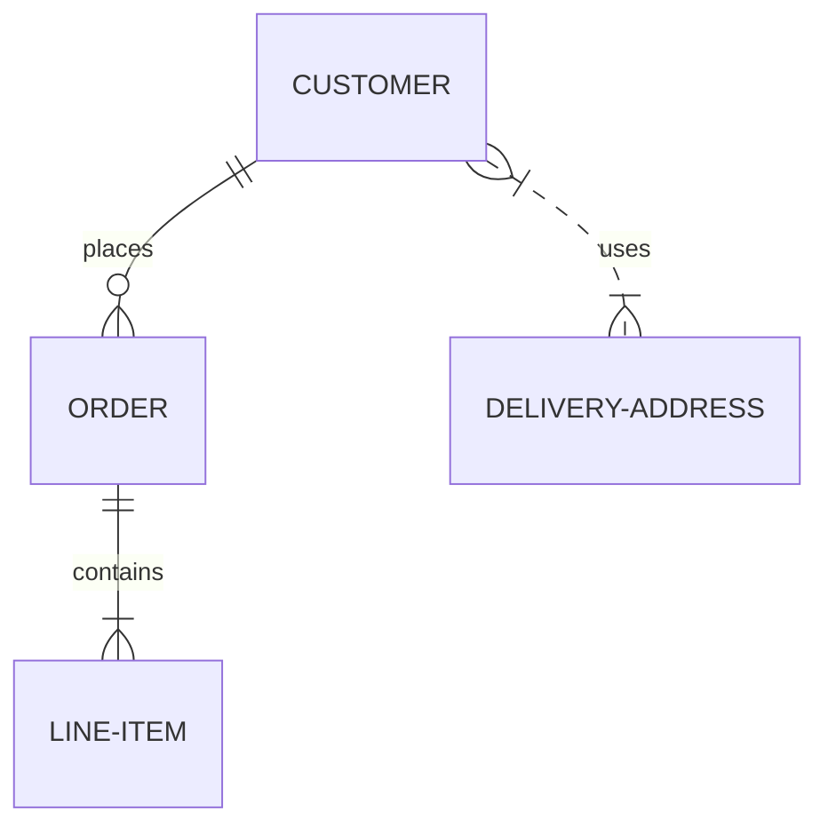

# Шаблон документа описания архитектуры (Software Design Document - SDD)

## 1. Введение

### 1.1. Цель
[Опишите цель данного документа. Для кого он предназначен и какую информацию содержит.]

### 1.2. Область применения
[Опишите, к какой системе или подсистеме относится данный документ. Укажите границы системы.]

### 1.3. Определения, акронимы и сокращения
| Термин | Определение |
|--------|-------------|
| SDD    | Software Design Document (Документ описания архитектуры) |
| API    | Application Programming Interface |
| ...    | ... |

### 1.4. Ссылки
[Список документов, на которые есть ссылки в данном документе (ТЗ, SRS и т.д.)]

## 2. Обзор системы
[Краткое описание системы, её назначение и основные функции. Контекстная диаграмма может быть полезна здесь.]

## 3. Архитектура системы

### 3.1. Архитектурный стиль
[Описание выбранного архитектурного стиля (монолит, микросервисы, клиент-сервер и т.д.) и обоснование выбора.]

### 3.2. Диаграмма архитектуры
[Вставьте диаграмму высокого уровня, показывающую основные компоненты и связи между ними. Можно использовать Mermaid.]

### 3.3. Описание компонентов
[Подробное описание каждого основного компонента системы.]

#### 3.3.1. [Название компонента 1]
*   **Назначение:** [Что делает компонент]
*   **Технологический стек:** [Языки, фреймворки]
*   **Взаимодействия:** [С какими компонентами взаимодействует]

#### 3.3.2. [Название компонента 2]
...

## 4. Проектирование данных

### 4.1. Модель данных
[ER-диаграмма или описание сущностей и связей.]

### 4.2. Схема базы данных
[Описание таблиц, коллекций, индексов и т.д.]

### 4.3. Хранение и управление данными
[Стратегии кэширования, репликации, резервного копирования.]

## 5. Проектирование интерфейсов

### 5.1. Пользовательский интерфейс (UI)
[Описание принципов построения UI, макеты (wireframes) или ссылки на дизайн-макеты (Figma).]

### 5.2. Программные интерфейсы (API)
[Описание внешних и внутренних API. Ссылки на спецификации OpenAPI/Swagger.]

*   **Endpoint 1:** `GET /api/resource`
*   **Endpoint 2:** `POST /api/resource`

## 6. Нефункциональные требования и решения

### 6.1. Безопасность
[Аутентификация, авторизация, шифрование данных, защита от атак.]

### 6.2. Производительность и масштабируемость
[Требования к времени отклика, пропускной способности. Стратегии масштабирования.]

### 6.3. Надежность и доступность
[Обработка сбоев, мониторинг, логирование.]

## 7. Инфраструктура и развертывание
[Требования к оборудованию, схема развертывания (Deployment Diagram), CI/CD пайплайны.]

## 8. План тестирования
[Стратегия тестирования: модульные тесты, интеграционные тесты, нагрузочное тестирование.]

## 9. Приложения
[Дополнительная информация, диаграммы, таблицы.]
